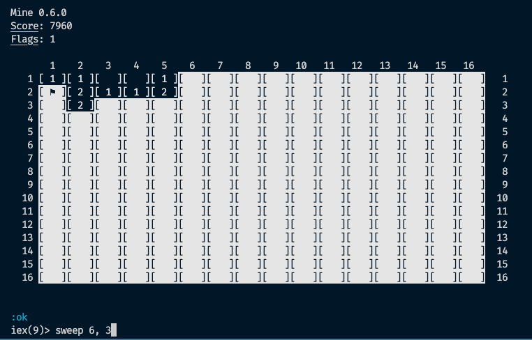

# Mine

Mine Sweeper typical game but it uses the terminal and it's developed using Elixir.

If you love this content and want we can generate more, you can support us:

[](https://www.paypal.com/donate/?hosted_button_id=XK6Z5XATN77L2)

## Getting started

You only need to clone this repository and compile it. Ensure you have installed Elixir 1.8+ and Erlang 20+. This was developed using Erlang 22.0 and Elixir 1.8.2.

```
git clone https://github.com/altenwald/mine.git
cd mine
iex -S mix
```

Once you are inside the Elixir shell you can use the functions inside of the `Mine` module to interact with the game. The game should be running, so it's not needed to start it, but if you want, you can restart it:

```elixir
restart
```

To discover a cell use:

```elixir
sweep 1, 1
```

You have to pass the X and Y coords. When you find or think you have a flag you can mark it as:

```elixir
flag 1, 2
```

You can see here an example:

[](screenshot.png)

You can open an issue, pull a request or send us a comment when you want.

Enjoy!
